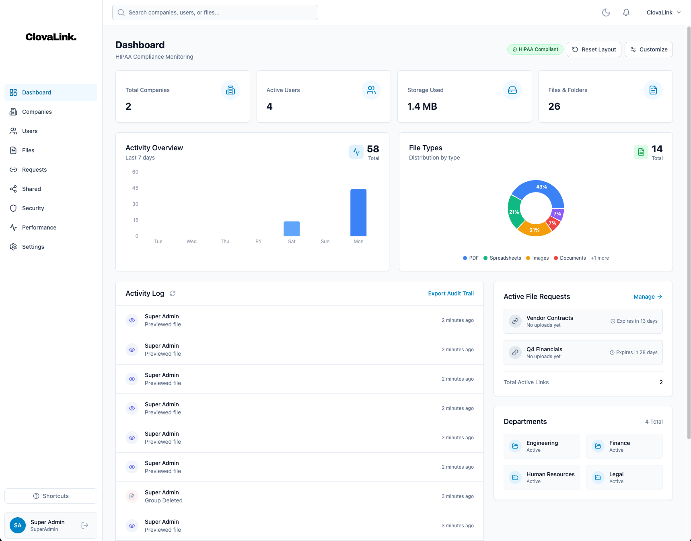
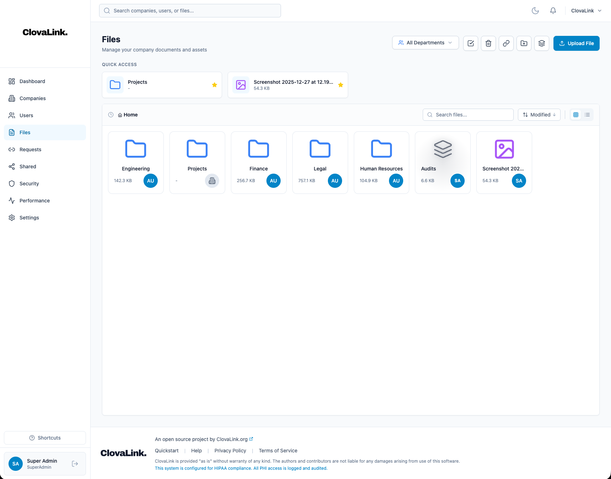

# ClovaLink Documentation

Welcome to ClovaLink - an open-source, multi-tenant file management and compliance platform built with Rust and React.

## Screenshots

<table>
<tr>
<td width="50%">

<p align="center"><b>Dashboard</b></p>
</td>
<td width="50%">

<p align="center"><b>File Browser</b></p>
</td>
</tr>
</table>

**[View all 23 screenshots →](Screenshots.md)**

## Overview

ClovaLink provides secure file storage, sharing, and compliance features for organizations of all sizes. It supports multiple compliance frameworks (HIPAA, SOX, GDPR) and offers a flexible extension system for customization.

## Key Features

### File Management
- **Secure Upload/Download** - End-to-end encrypted file transfers
- **File Requests** - Create secure upload portals for external users
- **Version Control** - Automatic file versioning for compliance
- **Folder Structure** - Hierarchical organization with department isolation
- **Deduplication** - Content-addressed storage reduces redundant data
- **S3 Replication** - Async backup/mirror to secondary bucket for DR
- **File Groups** - Organize files into virtual collections without moving them
- **Company Folders** - Shared folders visible to all departments
- **Resizable Columns** - Drag column borders to resize in list view, double-click to reset
- **Display Density** - Compact, Normal, and Comfortable row sizing modes
- **Items-per-Page** - Choose Auto, 10, 25, 50, or 100 items per page
- **Per-User Preferences** - View mode, density, column widths, and pagination saved per user

### AI Features
- **Document Summarization** - AI-generated summaries for PDFs, Word, and text files
- **Question & Answer** - Ask questions about document content
- **Multiple Providers** - OpenAI, Anthropic, Google, Azure, Mistral, Cohere
- **Self-Hosted Support** - Use Ollama, vLLM, or any OpenAI-compatible server
- **Usage Limits** - Configurable token and request limits per tenant

### Multi-Tenancy
- **Isolated Data** - Complete data separation between organizations
- **Custom Branding** - Per-tenant email templates and settings
- **Department-based Access** - Fine-grained access control within tenants
- **Storage Quotas** - Configurable limits per organization

### Security & Compliance
- **Virus Scanning** - ClamAV integration scans all uploads for malware
- **Password Policies** - Configurable per-tenant requirements
- **IP Restrictions** - Allowlist/blocklist IP access controls
- **Session Fingerprinting** - Detect and prevent token theft
- **MFA Support** - TOTP-based two-factor authentication
- **Audit Logging** - Complete activity trails for compliance
- **GDPR Tools** - Data export and deletion request handling
- **Single Sign-On** - OIDC and SAML 2.0 with auto-provisioning and attribute mapping
- **Document Approval** - Policy-based approval workflow with card-based UI, bulk actions, and filtering
- **Backup & Restore** - Encrypted full-instance backup with ChaCha20-Poly1305 + Argon2id, BACKUP_MASTER_KEY required for scheduled auto-backups

### User Management
- **Role-Based Access Control (RBAC)** - Four base roles with customization
- **Custom Roles** - Create organization-specific permission sets
- **User Suspension** - Temporary access restrictions with reason tracking
- **Session Management** - View and revoke active sessions

### Notifications
- **Email Notifications** - Customizable email templates
- **In-App Notifications** - Real-time activity alerts
- **Per-User Preferences** - Users control their notification settings

### Extensions
- **UI Extensions** - Add custom interface components
- **File Processors** - Automate file handling workflows
- **Webhooks** - Integrate with external systems
- **Automation Jobs** - Scheduled background tasks

## Quick Start

### Prerequisites
- Docker and Docker Compose (or Podman)
- 4GB RAM minimum
- PostgreSQL 16+ (included in Docker setup)
- Redis 7+ (included in Docker setup)

### 1. Clone the Repository
```bash
git clone https://github.com/your-org/clovalink.git
cd clovalink
```

### 2. Configure Environment
```bash
cd infra
cp .env.example .env
# Edit .env with your settings (database, S3, JWT secret, etc.)
```

### 3. Start Services
```bash
docker compose up -d
```

### 4. Access the Application
- **Frontend**: http://localhost:8080
- **API**: http://localhost:3000
- **Health Check**: http://localhost:8080/health

### 5. Default Login
```
Email: superadmin@clovalink.com
Password: password123
```

> **Important**: Change the default password immediately in production!

## Documentation Index

| Section | Description |
|---------|-------------|
| [Screenshots](Screenshots) | Visual tour of all features |
| [API Reference](API-Reference) | Complete REST API documentation |
| [Architecture](Architecture) | System design and data flows |
| [Deployment Guide](Deployment-Guide) | Production deployment instructions |
| [Extensions SDK](Extensions-SDK) | Build custom extensions |
| [Admin Guide](Admin-Guide) | Tenant and user management |
| [Security](Security) | Security features and configuration |
| [Virus Scanning](Virus-Scanning) | ClamAV integration and malware protection |
| [Discord Integration](Discord-Integration) | Discord DM notifications setup |
| [AI Features](AI-Features) | AI-powered summarization, Q&A, and search |
| [File Groups](File-Groups) | Organize files into virtual collections |
| [SSO Authentication](SSO-Authentication) | OIDC and SAML 2.0 single sign-on |
| [Document Approval](Document-Approval) | Policy-based document approval workflows |
| [Backup & Restore](Backup-Restore) | Encrypted backup, import, and settings profiles |

## Tech Stack

### Backend
- **Language**: Rust 1.75+
- **Framework**: Axum (async web framework)
- **Database**: PostgreSQL 16 with SQLx
- **Cache**: Redis 7
- **Storage**: Local filesystem or S3-compatible (AWS, Backblaze B2, MinIO) with optional replication
- **Authentication**: JWT with session fingerprinting

### Frontend
- **Framework**: React 18 with TypeScript
- **Styling**: Tailwind CSS
- **State Management**: React Query (TanStack Query)
- **Build Tool**: Vite
- **UI Components**: Headless UI, Lucide icons

### Infrastructure
- **Containerization**: Docker with multi-stage builds
- **Web Server**: Nginx (frontend proxy)
- **Orchestration**: Docker Compose / Podman

## License

ClovaLink is open source software licensed under the MIT License.

## Support

- **GitHub Issues**: Report bugs and feature requests
- **Discussions**: Community support and questions
- **Wiki**: This documentation

---

*ClovaLink v0.1.6 - An open source project*

